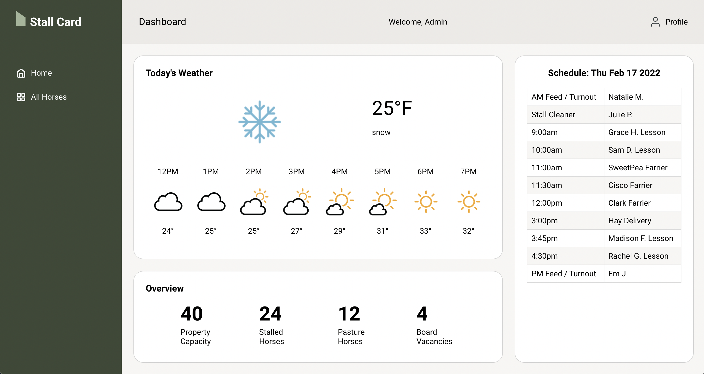
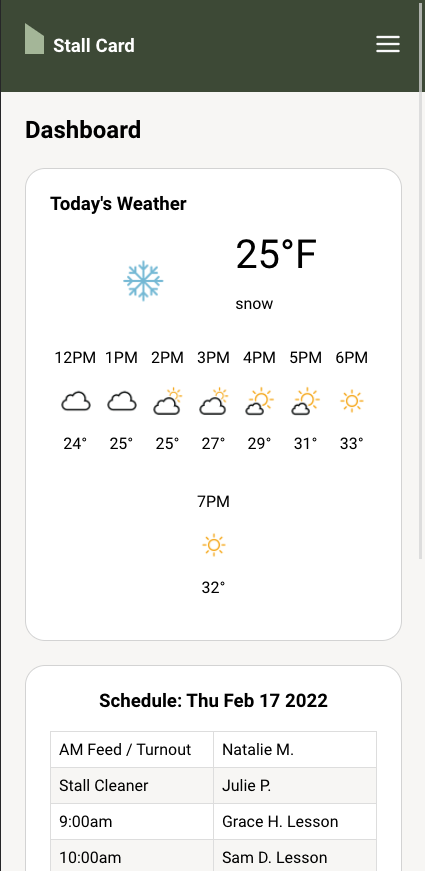

# Stall Card

### Turing Mod 4 Capstone Project

## Table of Contents
- [Abstract](#Abstract)
- [Technologies](#Technologies)
- [Experience](#Experience)
- [Illustrations](#Illustrations)
- [Install](#Install)
- [Wins](#Wins)
- [Challenges](#Challenges)
- [Additions](#Additions)
- [Contributors](#Contributors)

## Abstract
Stall Card is a progressive web app created to solve the challenges of running a large-scale horse boarding barn. Horses have very individualized care needs. These needs often change with the horse's age, health, weather, etc. Barn's with many horses and multiple employees often struggle to keep everyone up to date with these changes, and to train new employees who aren't yet familiar with every animal. 

Stall Card addresses these challenges with an app designed for the barn manager. The user can add, edit, and delete a profile for each horse, which includes biographical details, feeding instructions, and important contacts. 

## Technologies
-  HTML
-  CSS / SASS
-  JavaScript
-  React
-  Hooks
- GraphQL / Apollo
- Cloudinary
- PWA
- Cypress
- Circle CI

## Experience
On the `Home` page, you will see a `weather widget` that displays the current weather and a forecast for the next 8 hours. You will also see a daily `schedule` that includes employee shifts, riding lessons, and appointments, and an `overview` of the number of horses on property. 

## Illustrations

## Install

-  Clone this [repo](https://github.com/elisebeall/dnd-spells) to your machine
-  cd into the directory `dnd-spells`
-  Run `npm install`
-  Run `npm start`

## Wins
- Researching Context Api and implementing it
- Using Hooks to help manage state

## Challenges
- context api
- Custom hooks
- Building a React app of this size

## Additions
### Future Iterations
- Add ability to create a character
- Impliment ability to sort spells by level

## Contributors
- [August Reid](https://github.com/augustreid)
- [Brian Peterson](https://github.com/bpeterson2579)
- [Elise Beall](https://github.com/elisebeall)
