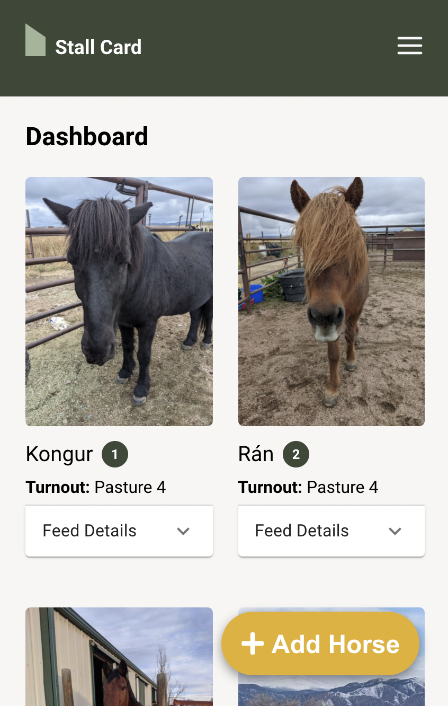
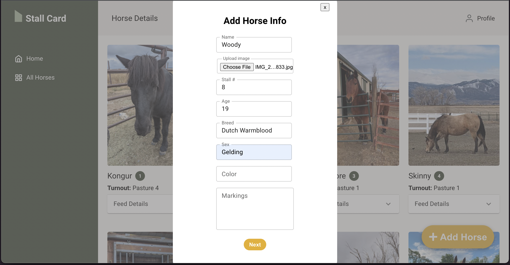
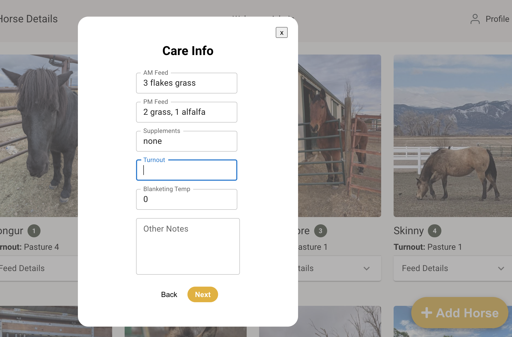
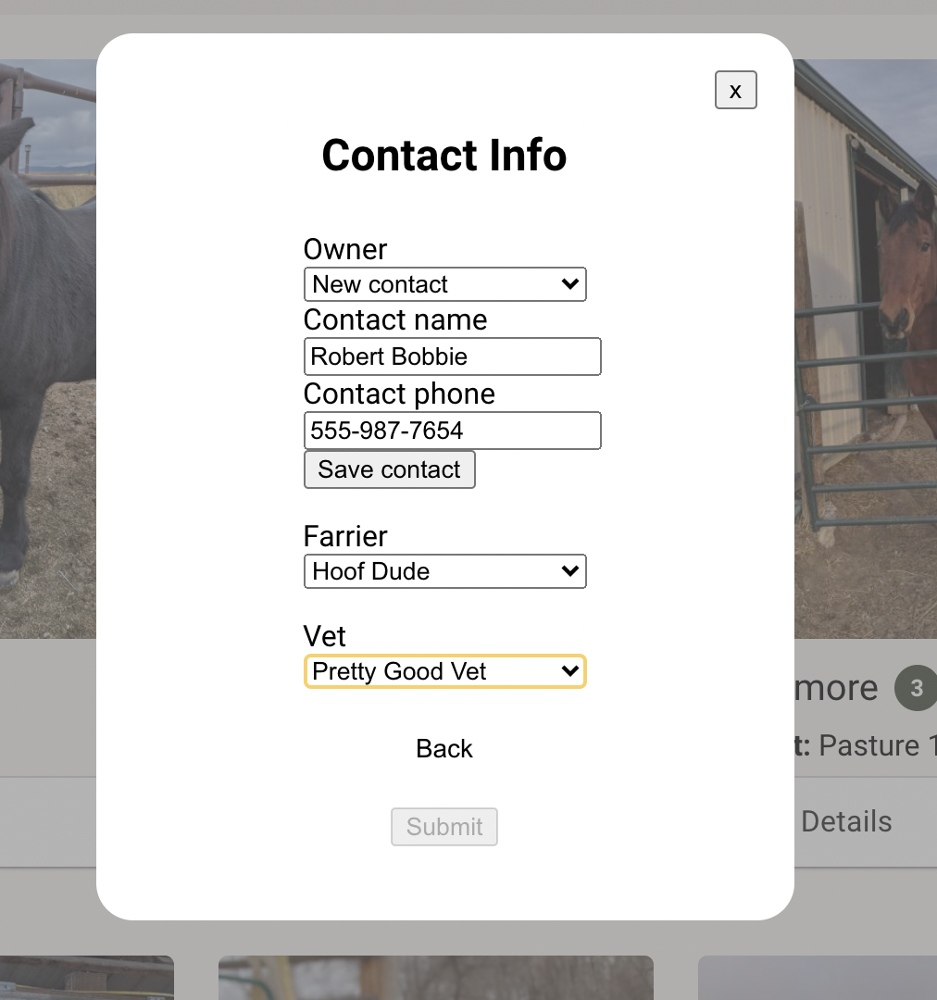
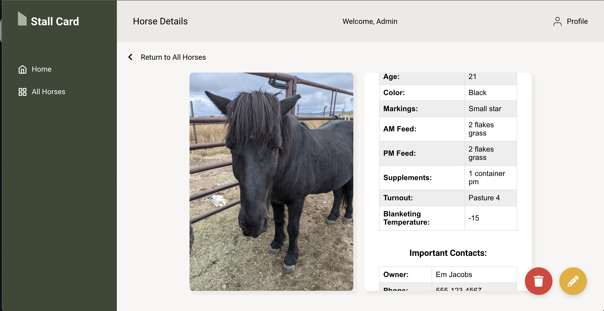
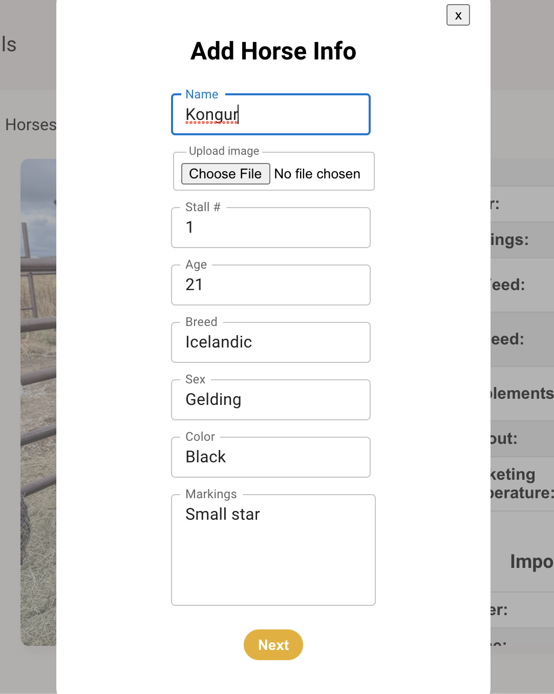
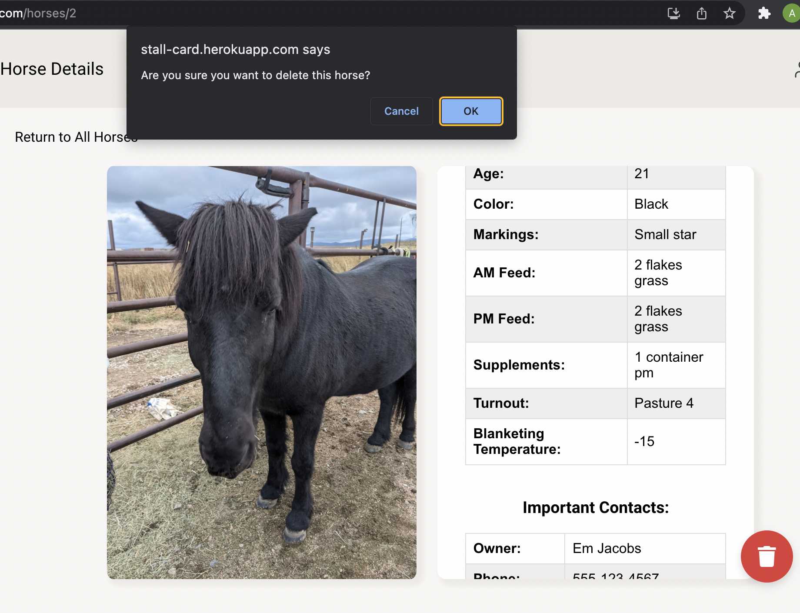

# Stall Card

### Turing Mod 4 Capstone Project

## Table of Contents
- [Abstract](#Abstract)
- [Technologies](#Technologies)
- [Experience](#Experience)
- [Illustrations](#Illustrations)
- [Install](#Install)
- [Wins](#Wins)
- [Challenges](#Challenges)
- [Additions](#Additions)
- [Contributors](#Contributors)

## Abstract
Stall Card is a progressive web app created to solve the challenges of running a large-scale horse boarding barn. Horses have very individualized care needs. These needs often change with the horse's age, health, weather, etc. Barn's with many horses and multiple employees often struggle to keep everyone up to date with these changes, and to train new employees who aren't yet familiar with every animal. 

Stall Card addresses these challenges with an app designed for the barn manager. The user can add, edit, and delete a profile for each horse, which includes biographical details, feeding instructions, and important contacts. 

## Technologies
-  HTML
-  CSS / SASS
-  JavaScript
-  React
-  Hooks
- GraphQL / Apollo
- Cloudinary
- PWA
- Cypress
- Circle CI

## Experience
On the `Home` page, you will see a `weather widget` that displays the current weather and a forecast for the next 8 hours. You will also see a daily `schedule` that includes employee shifts, riding lessons, and appointments, and an `overview` of the number of horses on property. 

On the left side of the screen, or at the top on mobile view, there is a navigation `menu`. Select the `All Horses` option, and you will be taken to a page with all horses currently at the stable. The horses are displayed with a photo, name, stall number, and an accordian that reveals feeding details. 

From the All Horses page, you can **click** the yellow `Add New Horse` button in the bottom right. This will open a `form` to fill out with all the horse's information. The form includes a button to upload a photo. The form will take you through several pages to add all necessary information, and when adding contacts, you can either select one of the existing contacts or add a new one. Once you `click` submit, the horse will be added to your barn. 

From the All Horses page, **click** on a horse photo, and you will be taken to the horse `profile` page, which displays all available information, including contact info for owner, vet, and farrier. 
From the profile, you can **click** the yellow `edit` icon to open a form and edit update information about this horse. You can also **click** the red `delete` icon, which will create an alert to make sure you want to delete the horse. 

## Install
-  Clone this [repo](https://github.com/Stall-Card-App/stall-card-fe) to your machine
-  cd into the directory `stall-card-fe`
-  Run `npm install`
-  Run `npm start`

## Wins
- Working with a great backend team to build out our server.
- Implementing GraphQL. 
- Successfully uploading and storing images using Cloudinary.

## Challenges
- GraphQL posed some challenges, and wasn't fully necessary for the scale of the project. 
- Finding a solution to image storage.
- Navigating CORS issues between the FE and BE teams.

## Additions
### Future Iterations
- Create barn login with location to retrieve correct weather.
- Create employee view that does not have CRUD functionality.
- Integrate a calendar and scheduling functionality.
- Send text alerts to employees when a horse's information is updated.

## Contributors
- [August Reid](https://github.com/augustreid)
- [Brian Peterson](https://github.com/bpeterson2579)
- [Elise Beall](https://github.com/elisebeall)
